# Arquitectura del SimpleAgent

Este documento describe la arquitectura del SimpleAgent basado en LangGraph y cómo cada componente funciona e interactúa con los demás.

## 1. Visión General

SimpleAgent implementa una arquitectura conversacional basada en grafos donde cada nodo representa una fase específica en el ciclo de procesamiento de conversaciones. Utiliza LangGraph para la gestión del flujo de estados y LangChain para la integración de herramientas especializadas.

### Flujo Básico

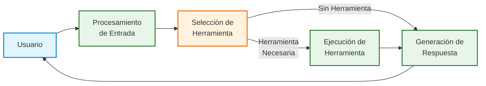

## 2. Componentes Principales

### 2.1 Estado de Conversación `ConversationState`

El objeto de estado funciona como la memoria de trabajo para el agente, manteniendo toda la información relevante durante el ciclo de vida de la conversación.

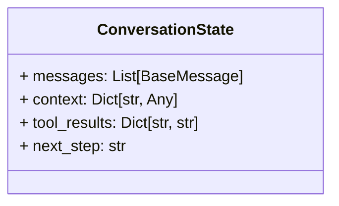

**Componentes del Estado:**
- **messages**: Historial completo de mensajes (humano y AI)
- **context**: Información contextual sobre la conversación actual
- **tool_results**: Resultados de las ejecuciones de herramientas
- **next_step**: Indicador del siguiente paso en el flujo de ejecución

### 2.2 Arquitectura del Grafo de Estados

El grafo de estados implementa la lógica de flujo principal del agente:

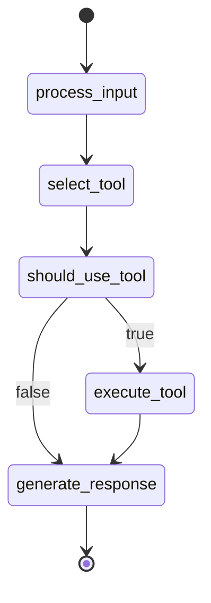

### 2.3 Herramientas Especializadas

El agente utiliza herramientas modulares para realizar tareas específicas.

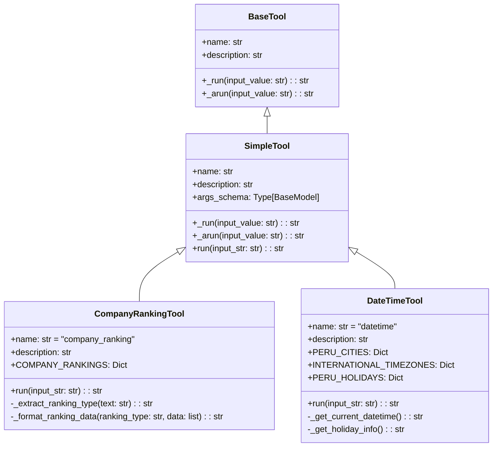

### 2.4 Manejo de Solicitudes Múltiples

Una característica avanzada del SimpleAgent es la capacidad de procesar múltiples solicitudes en un solo mensaje:

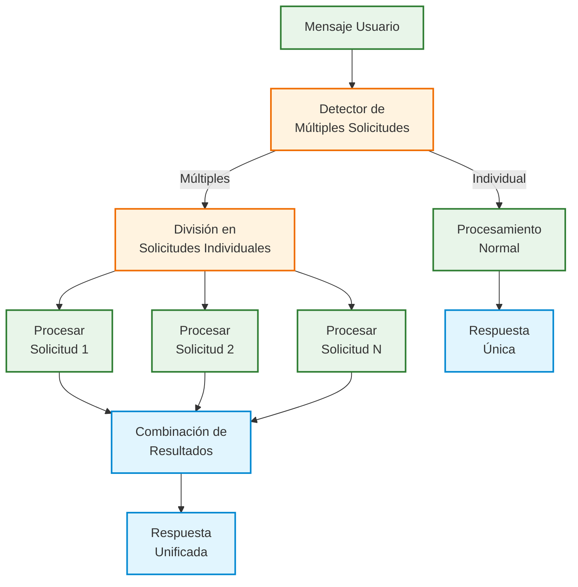

## 3. Flujo de Datos Detallado

### 3.1 Procesamiento de un Mensaje

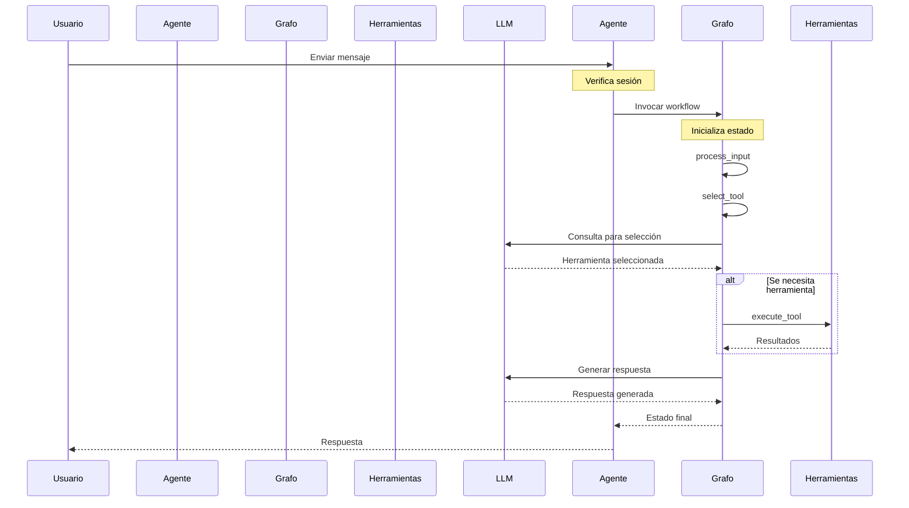

### 3.2 Proceso de Detección de Intenciones

El agente utiliza un sistema de detección en capas para identificar con precisión las intenciones del usuario:

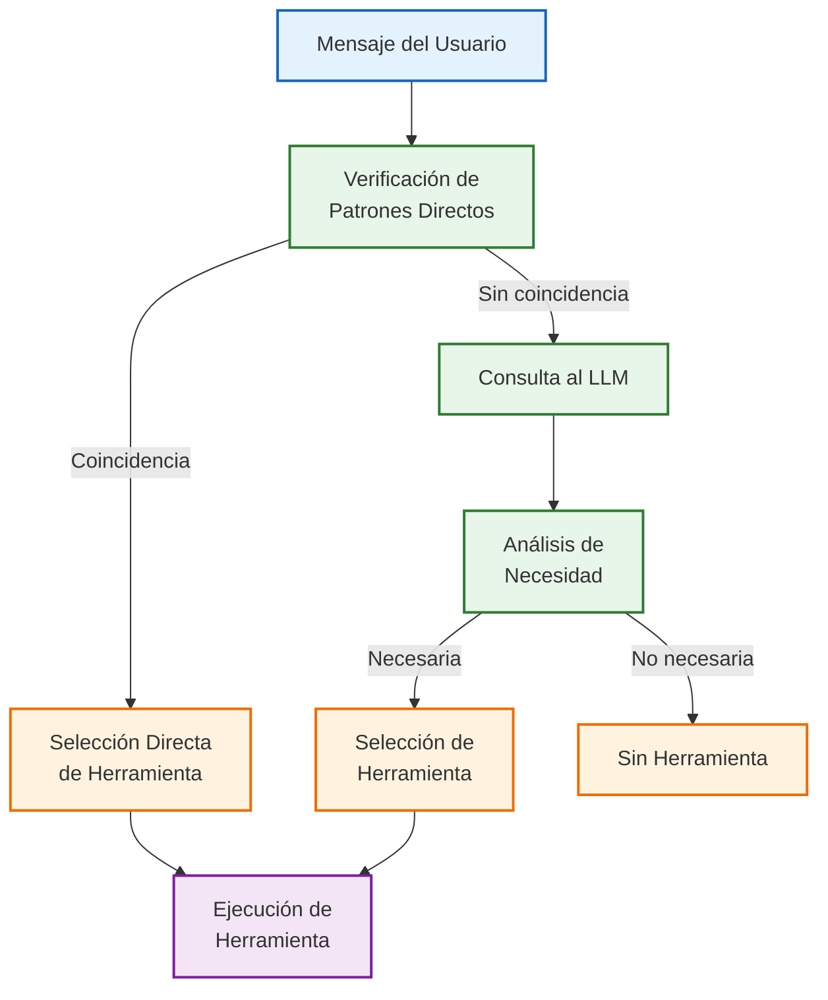

## 4. Interacción entre Componentes

El siguiente diagrama ilustra cómo los componentes interactúan durante una conversación completa:

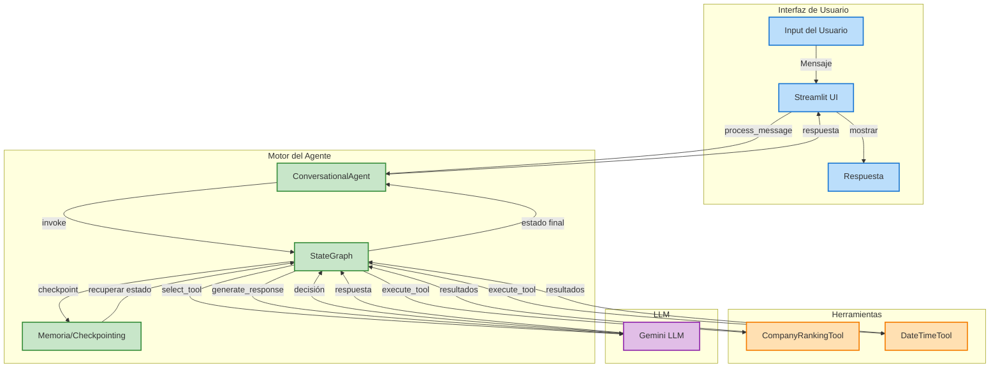

## 5. Arquitectura de Sesiones y Memoria

El agente mantiene un contexto para cada sesión de usuario:

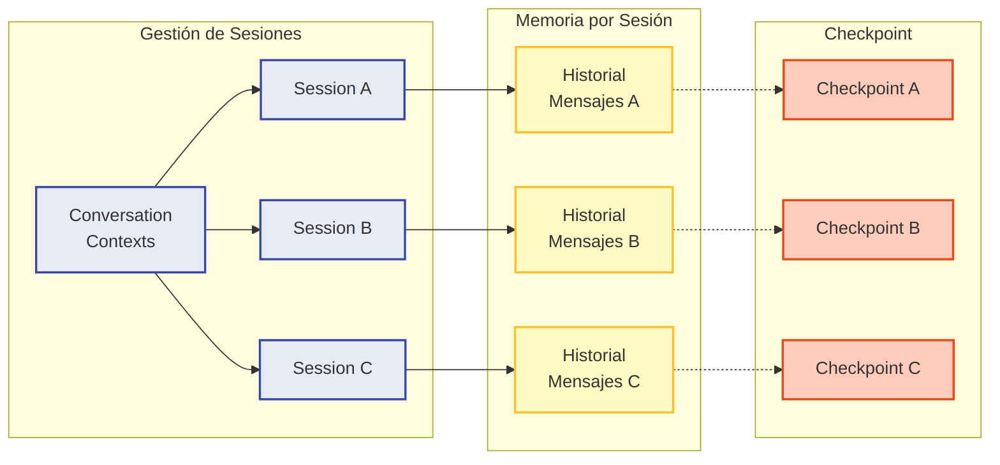

## 6. Extensibilidad

La arquitectura de SimpleAgent está diseñada para ser altamente extensible:

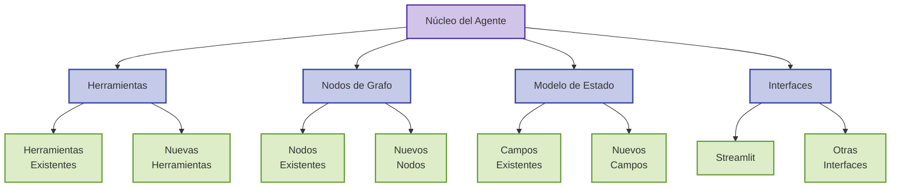

## 7. Consideraciones para Desarrollo Futuro

### 7.1 Mejoras Potenciales

- **Razonamiento en Cadena (Chain-of-Thought)**: Implementar nodos adicionales para razonamiento paso a paso en consultas complejas.
- **Recuperación de Conocimiento**: Integrar bases de conocimiento externas para mejorar la precisión de las respuestas.
- **Aprendizaje Continuo**: Mecanismos para actualizar y refinar las capacidades del agente basándose en interacciones pasadas.
- **Personalización**: Adaptación del comportamiento del agente según preferencias del usuario.
- **Herramientas Adicionales**: Expandir el conjunto de herramientas para cubrir más dominios.

### 7.2 Arquitectura Futura Propuesta

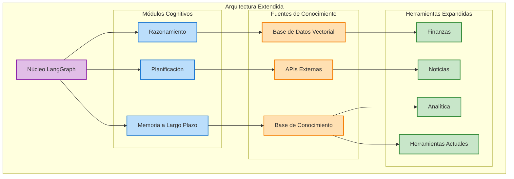